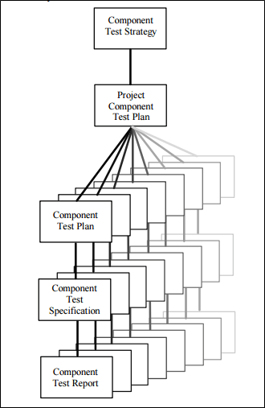

4.2) Component testing
  
Component testing is a software testing type, and it’s the process of testing each individual component alone, separately from the other components, to make sure all the components work perfectly. The diagram below shows the process of testing out the individual components. 
[1] 
Component testing varies from domain to domain and organization to organization, and they differ depending on what type of Development Life Cycle model has been chosen, the complexity of the software/applications that’s being tested, and testing the components individually or with other components within the software. The systems Development Life Cycle is a theoretical model used in project management that explains the process involved in an information system development project, from an initial feasibility study through maintenance of the completed application. There are many different System Development Life Cycle methodologies, such as Rapid Applications Development, Build and Fix, and Synchronize-and-Stabilize, to guide the processes involved. The original System Development Life Cycle is Waterfall, and another common model is called Agile Software Development.

5.3) Gherkin Code
Sanitising User entered text:
Scenario: Inappropriate use of account
Given the user is trying to access files and websites that are not meant to be accessed
And the user successfully accessed the files of websites
And the user uses those files or websites inappropriately
Then the user will get temporarily banned for inappropriate use of account
